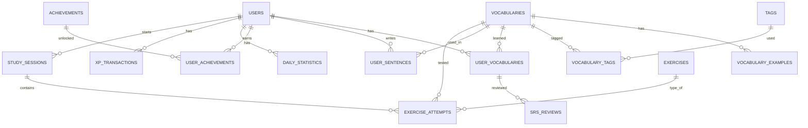

# Database (MySQL 8 + Prisma)

Schema khớp **chính xác ERD bạn cung cấp** (15 bảng). Nguồn sự thật: `backend/prisma/schema.prisma`. PK dạng UUID (`CHAR(36)`), charset `utf8mb4`.

## ERD

## Nhóm bảng

| Nhóm | Bảng | Vai trò |
|---|---|---|
| Lõi | `users`, `vocabularies` | Tài khoản (kèm `daily_goal`, `current_streak`, `longest_streak`, `total_xp`); kho từ vựng chung |
| Nội dung từ | `vocabulary_examples`, `tags`, `vocabulary_tags` | 1 từ có N câu ví dụ; gắn nhãn many-to-many |
| Học cá nhân | `user_vocabularies`, `srs_reviews`, `user_sentences` | Từ đang học + trạng thái; lịch sử SM-2; câu user tự đặt |
| Luyện tập | `exercises`, `study_sessions`, `exercise_attempts` | Catalog 7 loại bài; phiên học; từng lần trả lời |
| Gamification | `achievements`, `user_achievements`, `daily_statistics`, `xp_transactions` | Thành tích; thống kê theo ngày; sổ cái XP |

## Quyết định thiết kế quan trọng

- **SM-2 thật, lưu ở `srs_reviews`**: `interval` và `ease_factor` *không* nằm ở `user_vocabularies` (đúng ERD). Trạng thái hiện tại lấy từ dòng `srs_reviews` mới nhất; `user_vocabularies.next_review_at` là bản sao denormalize để truy vấn nhanh "từ đến hạn ôn".
- **`exercises` là catalog LOẠI bài** (7 dòng seed: QUIZ, REVERSE_QUIZ, PINYIN, LISTENING, WRITING, SENTENCE, SPEAKING), không phải ngân hàng câu hỏi. Câu hỏi được sinh động từ `vocabularies`; `exercise_attempts.exercise_id` chỉ trỏ tới loại bài (`ON DELETE RESTRICT`).
- **Không có `users.last_active_date`** (ERD không có): streak suy ra từ `daily_statistics` — nếu hôm qua có dòng thì nối chuỗi, không thì reset về 1.
- **XP là sổ cái**: mỗi lần cộng XP tạo 1 dòng `xp_transactions` (`source` = `exercise_correct` | `daily_review_bonus` | `achievement`) đồng thời tăng `users.total_xp`.
- **Cột `string` trong ERD giữ dạng VARCHAR** (không dùng ENUM): `user_vocabularies.status` = `new|learning|mastered`; `study_sessions.session_type` = `mixed|daily_review|practice`; `user_sentences.status` = `pending|reviewed`.
- **Cascade**: xoá user/vocabulary xoá toàn bộ dữ liệu con. Ngoại lệ `exercise_attempts.exercise_id` = `RESTRICT`.
- **Bỏ `vocabularies.created_by_user_id`** của thiết kế cũ — ERD mới coi `vocabularies` là kho chung.

## Thuật toán

- **SM-2** (`services/srs.service.ts`): quality 0–5 (MVP: đúng→4, sai→2). Đúng: lần 1→1 ngày, lần 2→6 ngày, sau đó `interval × ease_factor`; sai: reset về 1 ngày. `ease_factor` tối thiểu 1.3.
- **Mixing Engine** (`services/mixing.service.ts`): `mixed` = 20% mới / 50% đến hạn / 30% từ yếu (`incorrect_count ≥ 2`), thiếu nhóm nào thì bù nhóm khác; `daily_review` ưu tiên tuyệt đối từ đến hạn. Chỉ *thứ tự* hiển thị được xáo trộn.
- **Mastery**: `mastery_level` 0–5 (tăng khi nhớ, giảm khi quên); đạt 5 → `status = mastered`.
